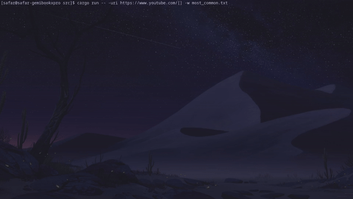

# Fuzzis
A CLI tool for web *fuzzing & brute-forcing, directories/files enumeration*. Written in Rust. 
Fuzzis is a good option for CTF's, cybersecurity enthusiasts and business security testers.

## Build
Build with cargo:
```
cargo build
```

## Usage 
**Console only!**
Provide *uri* (-uri) and *wordlist* (-w). 
To define where to fuzz - add [] (square brackets) inside uri
```
    Linux:
        ./fuzzis -uri https://examp[]le.com -w path/dir/my-wordlist.txt
    Windows:
        fuzzis.exe -uri https://examp[]le.com -w path/dir/my-wordlist.txt
```
## Example

## Flags
```
    Required:
        -uri : URI to buzz, brute-force
        -w : wordlist *.txt only*
    
    Optional:
        -t : amount of parallel threads. Default value is 3

    Help:
        -h, -help : prints help
    
```
